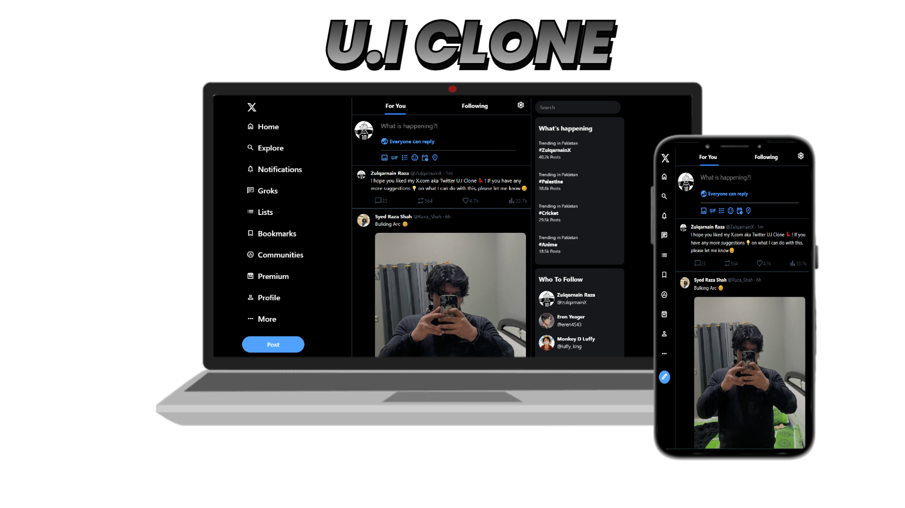

# X (Twitter) UI Clone

🚀 A sleek and responsive clone of X (formerly Twitter) built using **Tailwind CSS**. This project aims to replicate the modern design of X while focusing on clean code and performance.

## ✨ Features

- 📱 **Responsive Design** – Perfectly adapts to all screen sizes.
- 🎨 **Tailwind CSS** – Styled with utility-first CSS for fast and efficient styling.
- 🌙 **Dark Mode Support** – Mimics X’s modern dark UI.
- ⚡ **Optimized Performance** – Ensures fast load times and smooth user experience.

## 🛠️ Technologies Used

- **HTML** – For the structure.
- **Tailwind CSS** – For styling.

## 📷 Preview

Check out the live preview of the project:

🔗 [**Live Demo**](https://uiclone57.netlify.app/)

💙 **If you like this project, don't forget to star the repo! ⭐**

